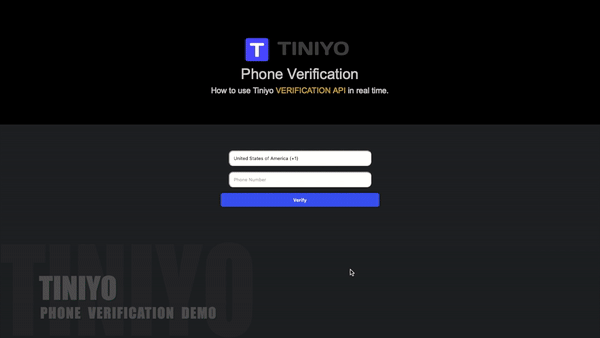

# Python-OTP-Verification
This repository allows, to create a phone number verification using sms/call OTP in python.



## Requirements
- Python 3.7
- Create a Free Account at Tiniyo [https://tiniyo.com]

## Setup

- Clone the jwt-go into your go path and change directory to cloned repository.

```bash
$ git clone https://github.com/tiniyo-api/python-otp-verification.git
$ cd python-otp-verification
```
- Setting up Virtual Environment

```bash
virtualenv env
source env/bin/activate
pip install -r requirements.txt
```
- Create your Free **TINIYO** Account and grab your **"API Key"**: <https://www.tiniyo.com>

- Copy ```.env.example``` to ```.env``` and update it with your **Tiniyo** credentials.

- Run the ```Phoneverify.py``` in your console.

```python
Phoneverify.py
```

*Navigate to <http://localhost:5000/phone_verification> to try it out!
